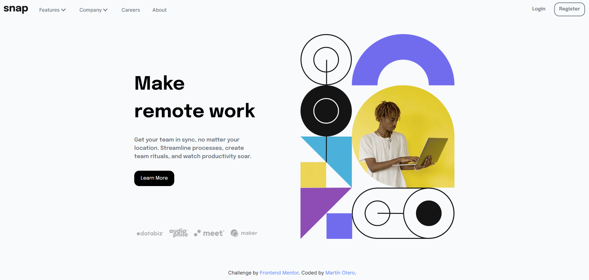
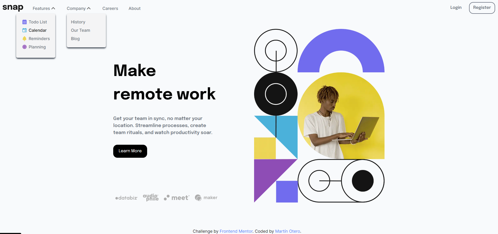
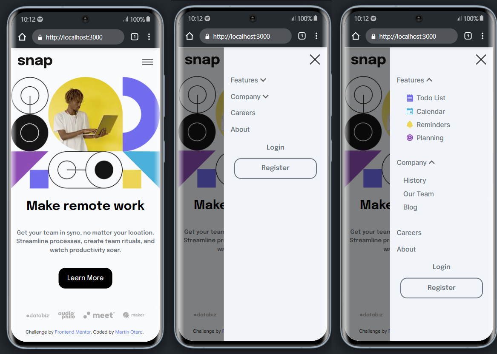

# Frontend Mentor - Intro section with dropdown navigation solution

This is a solution to the [Intro section with dropdown navigation challenge on Frontend Mentor](https://www.frontendmentor.io/challenges/intro-section-with-dropdown-navigation-ryaPetHE5). Frontend Mentor challenges help you improve your coding skills by building realistic projects.

## Table of contents

- [Overview](#overview)
  - [The challenge](#the-challenge)
  - [Screenshot](#screenshot)
  - [Links](#links)
- [My process](#my-process)
  - [Built with](#built-with)
  - [What I learned](#what-i-learned)
  - [Useful resources](#useful-resources)
- [Author](#author)

## Overview

### The challenge

Users should be able to:

- View the relevant dropdown menus on desktop and mobile when interacting with the navigation links
- View the optimal layout for the content depending on their device's screen size
- See hover states for all interactive elements on the page

### Screenshot

### Links

- Solution URL: [Add solution URL here](https://www.frontendmentor.io/solutions/intro-section-with-dropdown-menu-0nQOxTJ-rA)
- Live Site URL: [Vercel Deploy](https://intro-section-lyart.vercel.app/)

## My process

### Built with

- HTML5
- TailwindCSS
- [React](https://reactjs.org/) - JS library
- [Next.js](https://nextjs.org/) - React framework
- Mobile-first workflow

### What I learned

The most important things that I learned in this project were how to do the dropdown menus and the the mobile menu.

### Useful resources

- [Tailwind Doc Page](https://tailwindcss.com/docs/installation) - This helped me to remember a lot of things and learn new ones.

## Author

- Website - [Martín Otero Github](https://github.com/C0d3Drak3)
- Frontend Mentor - [@C0d3Drak3](https://www.frontendmentor.io/profile/C0d3Drak3)
